# L'archive: ask your recorded meetings, hear the answer

### Built for Synchrone · Albert School x Synchrone challenge · 3rd place overall, October 2026

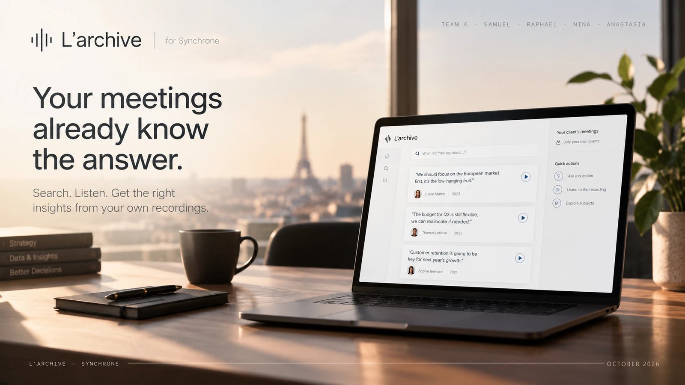

> **Ask a question, and the archive plays the sentence that answers it, from the second it was said. 19 of 20 test questions answered right to the second, at $0.0003 an answer.**

---

## What this project does

Synchrone is a French engineering consultancy of about 1,500 people. Much of what its consultants know is said in meetings, trainings and handovers, and leaves with them. The challenge asked for a way to question a thousand hours of recordings and get back the right minute.

L'archive does it inside the Dataiku that Synchrone already runs. A consultant asks in plain words. The archive answers with what was actually said, shows who said it and when, and plays the recording from that exact second. A consultant only ever searches the recordings of the clients they work for, and every question is written to an audit journal.

At the second jury review, the jury singled out two things: the access control and the interface.

---

## How it works, in eight steps

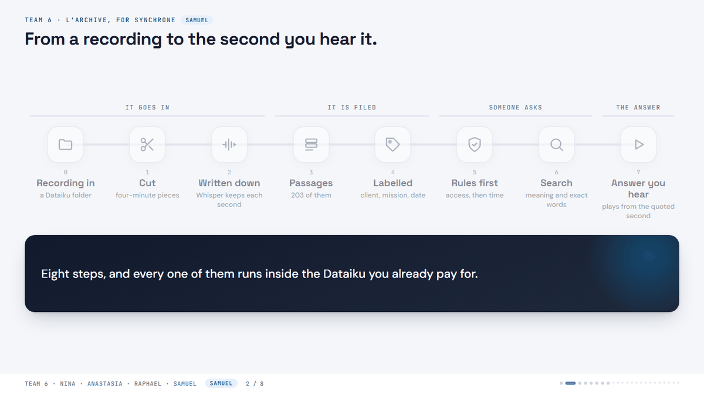

0. **The recording goes in.** The file is dropped into a folder in Dataiku. The demo archive holds six TED talks, 1 h 41 min in total. Only the sound is used.
1. **It is cut into four-minute pieces.** 75 minutes of audio is cut in 36 seconds. Because the pieces are short, the player never has to load a two-hour file.
2. **Whisper writes down what was said.** Speech recognition runs inside Dataiku, with no outside provider. Every sentence keeps the second it was said. 5.5 % of words differ from TED's human subtitles on the three Bill Gates talks.
3. **Sentences become passages.** Neighbouring sentences are joined into 203 passages. Each line inside a passage keeps its own file and second, so a quote points at the right place even when its passage crosses a four-minute cut, as 21 of them do.
4. **Each passage is labelled and stored.** It gets its client, its mission and the real date of the recording, then goes into Dataiku's knowledge bank so it can be found by meaning.
5. **Someone asks, and the rules run first.** Dataiku says who is asking, so there is no separate login. Recordings of clients they do not work on are removed before anything is searched: a CLIENT-A consultant searches 181 of the 203 passages. Then time: ask for the latest and newer passages weigh more; if a subject was recorded on several dates, the archive asks which one you want.
6. **The search.** By meaning and by exact words, the two lists combined by rank.
7. **The answer is written and checked.** The cheapest model writes the answer by quoting a line. Every quote is matched against the passages actually found: a checked one gets a play button that starts the recording at that second, an invented one shows in red and cannot play. If nothing in the archive answers, it says so. Every question goes to the journal: who asked, what came back, and what was withheld.

Each step in more detail, with the decisions behind it: **[docs/how-it-works.md](docs/how-it-works.md)**

---

## What sets it apart

| | |
|---|---|
| **You hear it** | Press play and the recording starts at the quoted second. Dataiku's own chat cites a file, never a second. |
| **Every quote is checked** | 26 of 26 citations matched the passages retrieved. A quote that matches nothing is shown in red and cannot be played. |
| **Access runs before the search** | A recording you may not see is never scored, never ranked and never sent to a model. 0 leaks in 3 cross-client probes. |
| **It kept answering without the model** | On 28 September the model provider's credit ran out for good. The archive switched to exact-word search and kept quoting the speakers' own sentences, labelled "sans modèle". |
| **Inside the Dataiku Synchrone already pays for** | Every step is a recipe or a dataset an engineer can open and rerun. No new platform to buy or secure. |

---

## Key results

Measured on a 25-question test set: 20 questions whose answer is in the recordings, 5 whose answer is not, and 3 attempts to reach another client's recording.

| Measure | With the model (24 Sep) | Without it (28 Sep) |
|---|---|---|
| Archive searched | 3 talks, 47 passages | 6 talks, 203 passages |
| Right answer, cited within 30 s of the true line | **19 of 20** | 7 of 20 |
| Citations verified against the passages retrieved | **26 of 26** | 17 of 17 |
| "Not in the archive" when it is not | **5 of 5** | 3 of 5 |
| Leaks between clients | **0 of 3** | 0 of 3 |
| Questions about time (latest, evolution, a named year) | not measured | 5 of 8 |
| Cost and time per answer | $0.0003, 2.3 s | $0 |

The archive grew between the two runs, so the drop mixes two causes: no model, and four times more passages.

| Pipeline measure | Value |
|---|---|
| Word error, Whisper large-v3 against TED's subtitles (11,021 words) | 5.5 % (2.1 %, 2.6 % and 6.8 % per talk) |
| Transcription speed, CPU container, no GPU | 0.55x to 0.70x real time |
| Audio preparation | 74.7 min of audio cut in 35.8 s |
| Citation markers that open the right file at the right second | 101 of 101 |

How each number was measured, and the failures we counted: **[docs/evaluation.md](docs/evaluation.md)**

---

## The screens

The interface is in French. A consultant gets two screens, Demander (ask) and Experts; partners also get Pilotage (the access journal) and Mesures (the measurements).

| | |
|---|---|
| 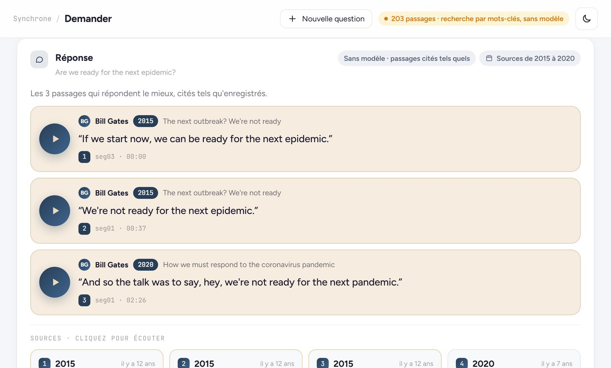 **An answer.** The passages that answer best, quoted as recorded, each with a play button, the speaker, the year and the second. | 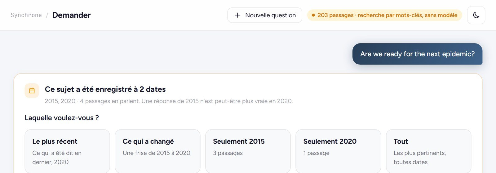 **Which date?** The subject was recorded in 2015 and 2020, so the archive asks which one you want before answering. |
| 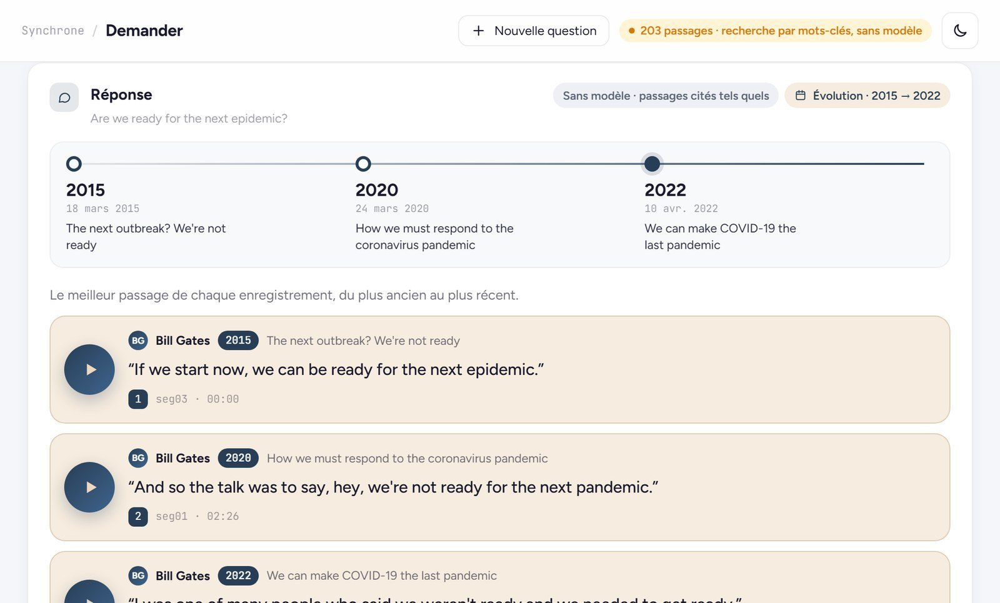 **What changed.** The best passage of each recording, oldest to newest. | 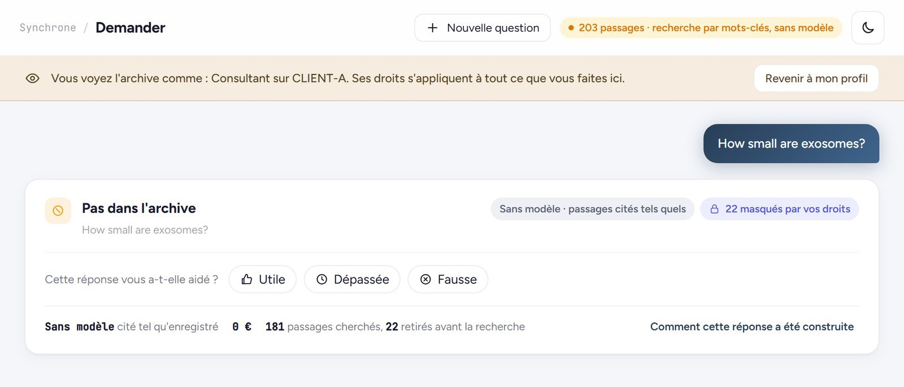 **Another client's recording.** Viewed as a CLIENT-A consultant, a question about CLIENT-B returns nothing: 22 passages were removed before the search. |
| 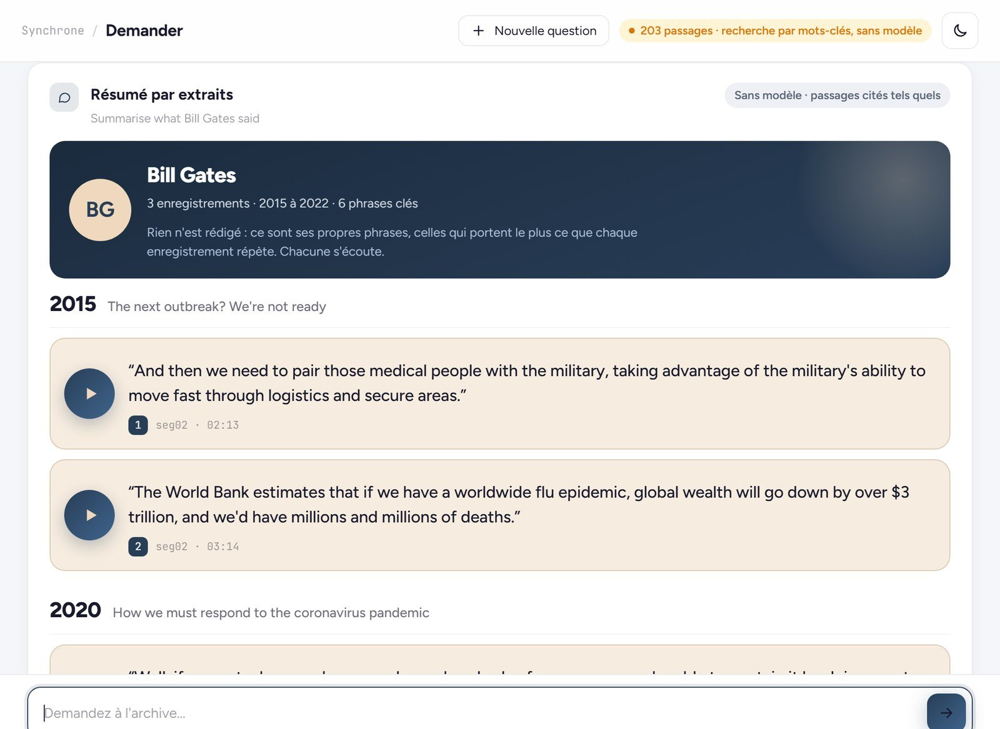 **What an expert said.** A summary by extracts: the speaker's own key sentences, year by year, each playable. | 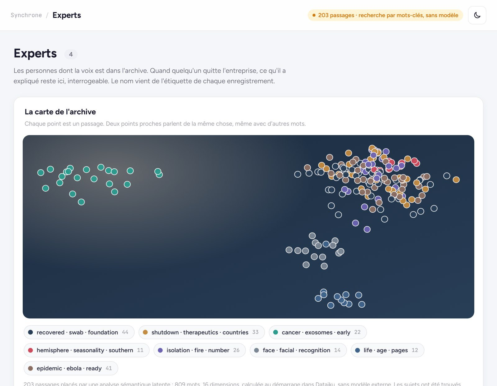 **The map of the archive.** Our own meaning model, computed inside Dataiku with no external model, places the 203 passages and names 8 subjects. |
| 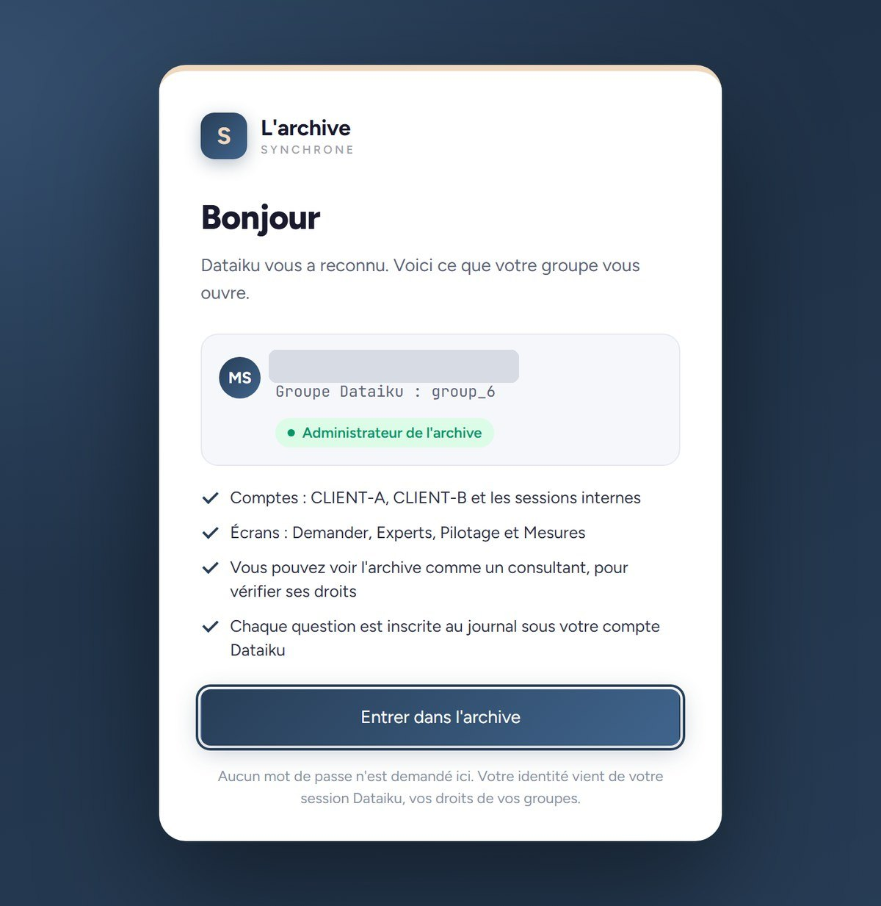 **No password.** Dataiku says who is asking, and the group gives the role. Account hidden. | 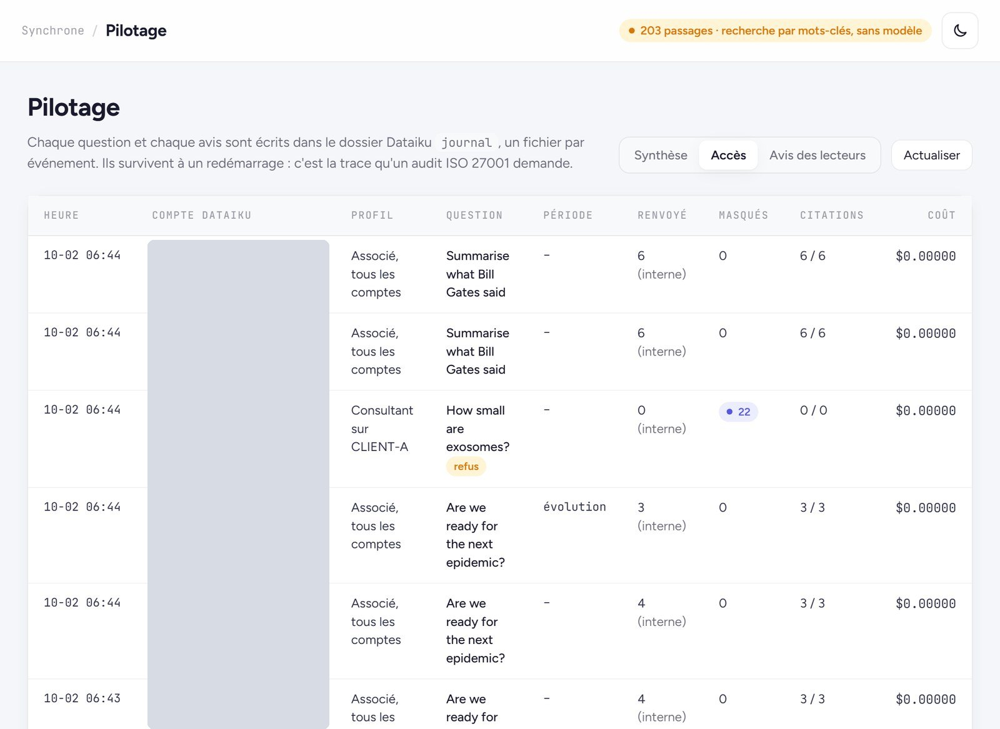 **The access journal.** Every question with its account, profile, what came back and what was withheld. Accounts hidden. |
| 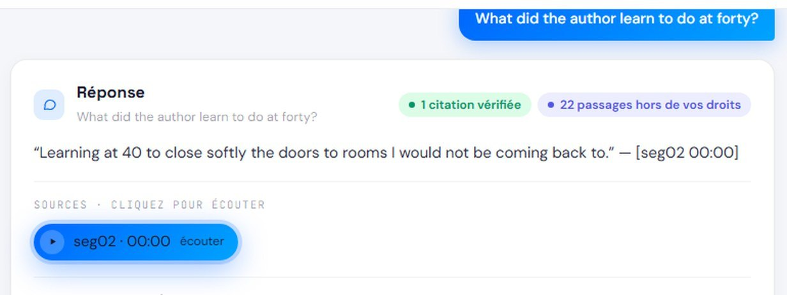 **Written by the model**, on 24 September, with one verified citation that plays. | 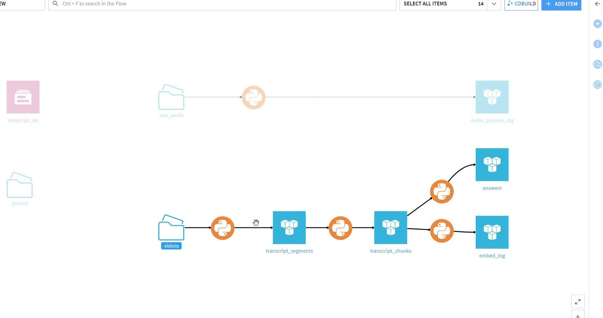 **The Dataiku Flow.** Recordings, transcription, segments, passages, embeddings and answers. |

---

## Technical stack

- **Platform:** Dataiku DSS 15 (Dataiku Cloud): Python recipes, managed folders, datasets, a knowledge bank, the LLM Mesh
- **Speech:** faster-whisper 1.2.1 with the large-v3 model, int8, on CPU; PyAV for decoding
- **Search:** text-embedding-3-small for meaning, a keyword search (BM25) written by hand, the two fused by rank
- **Answer:** gpt-5.6-luna through the LLM Mesh, the cheapest of the three models on the instance, chosen for all 25 test questions
- **Own meaning model:** latent semantic analysis in numpy, 16 dimensions, computed when the app starts
- **App:** a Dataiku webapp with a Flask backend (1,890 lines of Python) and a plain HTML, CSS and JavaScript front end (1,202 lines of JavaScript, no framework); audio streamed from the managed folder with byte ranges so the player can jump to any second
- **Design:** a console design system from an earlier product, recoloured to Synchrone's navy and sand

---

## What the platform taught us

Ten things we hit on Dataiku and what each one changed, among them: the model gateway reports a failed call as a success, the shared code environment installs a "whisper" package that is a time-series database, and vectors written through one convenient handle disappear when the container ends. **[docs/lessons-from-dataiku.md](docs/lessons-from-dataiku.md)**

---

## The team

Team 6, Albert School x Synchrone, September to October 2026.

- **Mugisha Samuel:** team lead and everything technical: the pipeline, the app, the evaluation and the product pitch
- **Nina:** what the archive is worth to Synchrone
- **Anastasia:** who would use it, and the market
- **Raphael:** the full cost, and how it scales

## Source code and access

The source code, the evaluation scripts, the Dataiku project export and the business case are kept in a private repository. Access on request.

## Rights

© 2026 Mugisha Samuel. All rights reserved. This repository may be read; no licence is granted to copy, modify or reuse its text, pictures or design. The business case belongs to its authors in Team 6. The TED talks used as test material are © TED Conferences LLC, licensed CC BY-NC-ND 4.0, and are not redistributed here.

---

## About

Built by **Mugisha Samuel**, BSc International Business & Data Analytics, Albert School x Mines Paris PSL.

